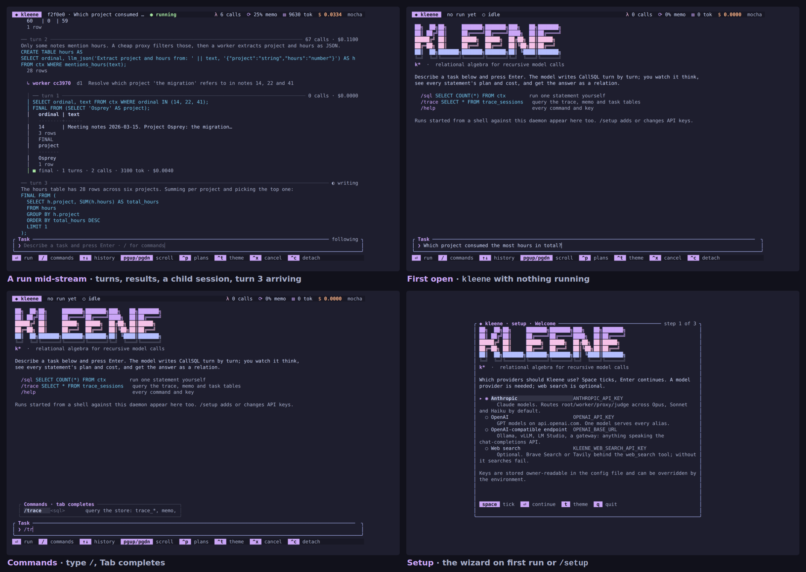
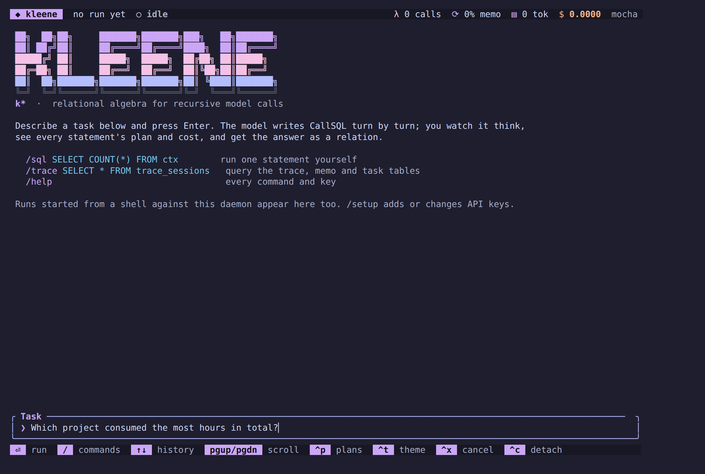
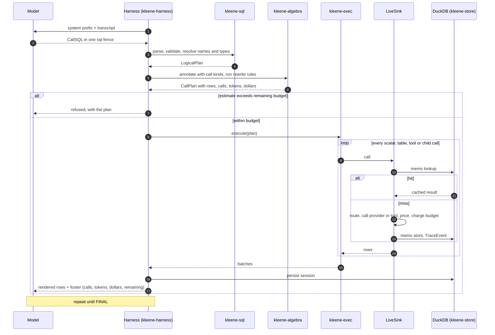
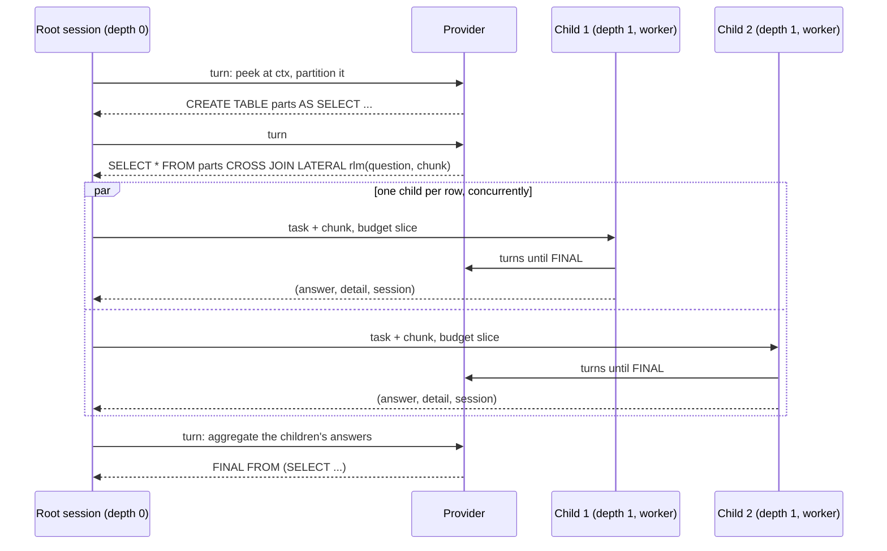
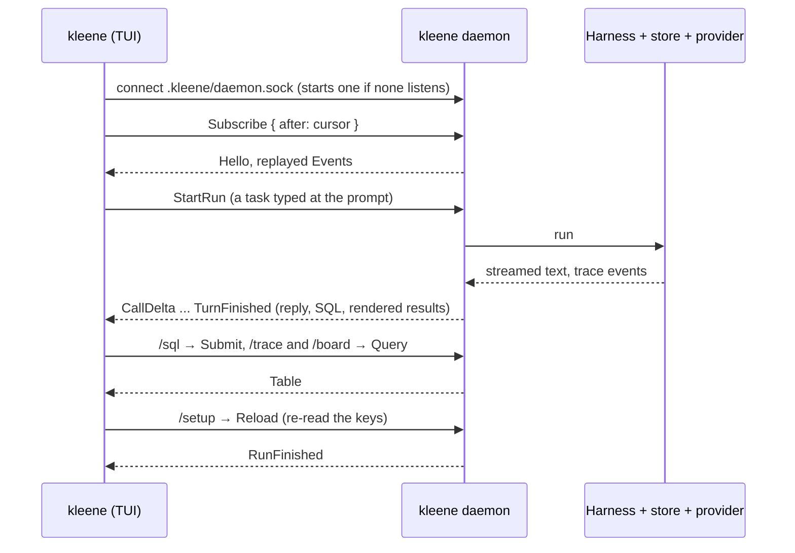
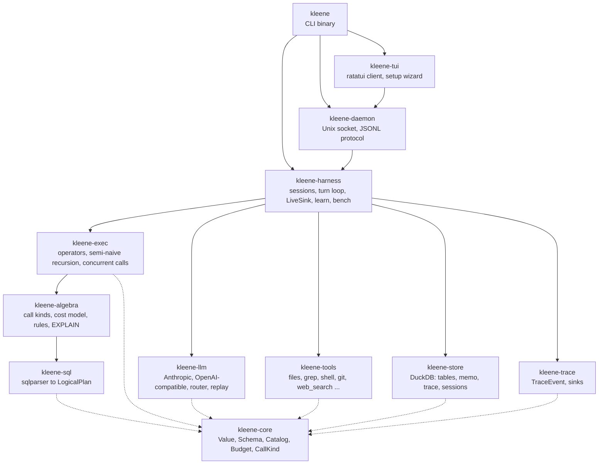
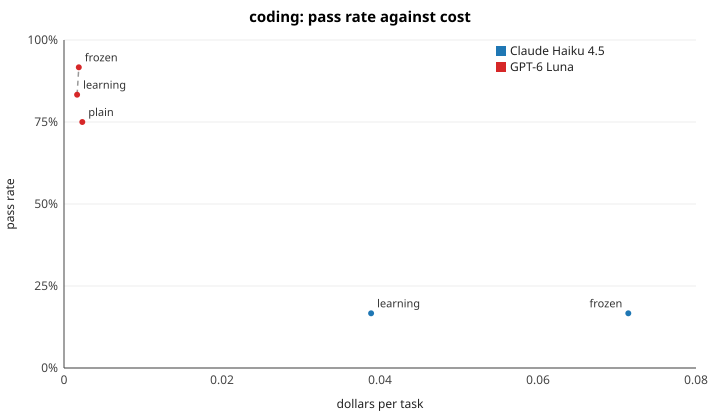
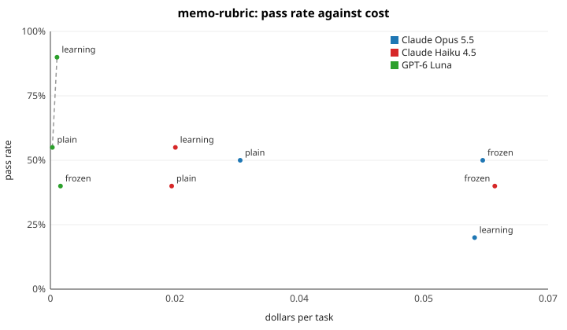

# kleene

**Kleene — relational algebra for recursive model calls.**

[![CI][ci-badge]][ci-link]
[![Release][release-badge]][release-link]
[![Rust 1.88+][msrv-badge]][msrv-link]
[![DuckDB inside][duckdb-badge]][duckdb-link]
[![License: MIT][license-badge]][license-link]

Write declarative SQL. Compile joins, recursion, predicates and aggregation
into an execution graph of language-model calls, recursive sub-sessions and
tool calls. Plan and cost that graph, run it, and query the trace with the
same SQL. Watch it happen in a terminal UI.

```sql
SELECT candidate
FROM possibilities
WHERE VERIFY(candidate)
  AND NOT EXISTS (
    SELECT 1 FROM counterexamples ce
    WHERE REFUTE(candidate, ce.text)
  );
```

`VERIFY` is one model call per distinct candidate. The `NOT EXISTS` is an
anti-semi-join that stops on the first refuting counterexample. `EXPLAIN`
tells you how many calls that is before you spend them.



- [Install](#install)
- [Quickstart](#quickstart)
- [Example runs](#example-runs)
- [How it works](#how-it-works): [one turn](#one-turn-of-a-session),
  [delegation](#delegation-rlm-and-spawn), [processes](#processes-cli-daemon-and-tui),
  [crates](#crates)
- [Commands](#commands)
- [Documentation](#documentation)
- [Status](#status)
- [Developing](#developing)
- [Why "Kleene"](#why-kleene)

## Install

Pick one of the three. Prebuilt binaries cover macOS (Apple silicon, Intel)
and Linux (x86_64, aarch64).

```bash
# curl: detects OS and architecture, verifies the SHA-256, installs to ~/.local/bin
curl -fsSL https://raw.githubusercontent.com/MarcusElwin/kleene/main/install.sh | sh

# Homebrew
brew install MarcusElwin/kleene/kleene

# From source (compiles DuckDB the first time, about ten minutes)
cargo install --git https://github.com/MarcusElwin/kleene kleene
```

`KLEENE_VERSION=v0.1.0` pins the installer to a tag and
`KLEENE_INSTALL=/usr/local/bin` changes the destination. While the
repository is private, the raw URL is not served; set `GITHUB_TOKEN` and fetch
the script through the API instead (see [`docs/CLI.md`](docs/CLI.md#curl)),
and use one of the [`cargo` variants](docs/CLI.md#cargo) that let the git CLI
authenticate.

Check that the engine works without a model:

```bash
kleene --version
kleene repl -c "SELECT 1 + 1 AS two"    # prints a one-row table: two = 2
```

Full install, provider and command reference: [`docs/CLI.md`](docs/CLI.md).

## Quickstart

**1. Point it at a model.** The wizard asks which providers to use and stores
the keys owner-readable under `~/.config/kleene/`; environment variables win
over the file when both are set:

```bash
kleene setup                               # Anthropic, OpenAI, or a compatible endpoint (Ollama, vLLM, a gateway);
                                           # optionally Brave, Tavily, Exa or Linkup for web_search
export ANTHROPIC_API_KEY=sk-ant-...        # or just the environment: routed root/worker/proxy/judge by default
export OPENAI_API_KEY=sk-...               # or any OpenAI-compatible endpoint (OPENAI_BASE_URL, OPENAI_MODEL)
```

**2. Run it.** `kleene` alone opens the terminal UI: one scrolling stream
with a prompt. Type a task, press Enter, watch the model's reply stream in,
its SQL run and the answer arrive. `/sql`, `/trace` and `/board` query the
engine from the same prompt and `/setup` opens the wizard without leaving
it. Or drive it from the shell:

```bash
kleene                                              # the UI, prompt bar focused
kleene run @demos/oolong/task.txt --context demos/oolong/corpus.txt --budget-calls 60
kleene trace "SELECT depth, role, outcome, turns, calls, dollars FROM trace_sessions ORDER BY started_at"
```

`kleene run` streams the reply as it is written, highlights the SQL, shows a
spinner while statements execute and prints the results and the final
relation as tables.

The model receives the context as a table `ctx(ordinal, text)` and writes
CallSQL turn by turn: it can `SELECT` over the context, define prompt
functions, call tools with `CALL`, delegate with `rlm(...)` and
`spawn(...)`, and finish with `FINAL`. Every model call is memoised, so
running the same task again is free. Everything lands in
`.kleene/run.duckdb` under the current directory.

<details>
<summary>More screenshots</summary>

| First open | A run mid-stream |
|---|---|
|  |  |

| Slash commands | `/setup` wizard |
|---|---|
|  |  |

</details>

## Example runs

Every example below is in [`demos/`](demos/README.md) or
[`tasks/`](tasks/README.md). They need a provider unless noted; a second run
of the same demo costs nothing because every call is memoised.

**Just `kleene`.** No flags. The first open shows a welcome card and a
prompt; the first thing worth typing is `/setup` if no key is configured
yet. Then describe a task and press Enter. The model's reply streams in,
each `sql` fence runs as it lands, every statement shows its rows and its
cost, and the answer arrives as a relation. A task typed here has no
`--context`; the model reads files through the workspace tools (`read`,
`chunks`, `grep`) rooted at the current directory.

```text
$ kleene
> Which project consumed the most hours in total? The notes are in demos/oolong/corpus.txt

── turn 1 ─────────────────────────────────────────────────────── 0 calls · $0.0000
No context table was given, so the notes come in through the workspace tools.
CREATE TABLE ctx AS
SELECT c.ordinal, c.text FROM read('demos/oolong/corpus.txt') r CROSS JOIN LATERAL chunks(r.text, 200) c;
SELECT COUNT(*), MIN(ordinal), MAX(ordinal) FROM ctx;
  60 | 0 | 59
  1 row

── turn 2 ────────────────────────────────────────────────────── 67 calls · $0.1100
Only some notes mention hours. A cheap proxy filters those, then a worker extracts project and hours as JSON.
CREATE TABLE hours AS
SELECT ordinal, llm_json('Extract project and hours from: ' || text, '{"project":"string","hours":"number"}') AS h
FROM ctx WHERE mentions_hours(text);
  28 rows

  ↳ worker cc3970  d1  Resolve which project 'the migration' refers to in notes 14, 22 and 41
  │ ── turn 1 ──────────────────────────────────────────────────── 0 calls · $0.0000
  │ SELECT ordinal, text FROM ctx WHERE ordinal IN (14, 22, 41);
  │ FINAL FROM (SELECT 'Osprey' AS project);
  │ ■ final · 1 turns · 2 calls · 3100 tok · $0.0040

── turn 3 ──────────────────────────────────────────────────────────────── writing
The hours table has 28 rows across six projects. Summing per project and picking the top one:
FINAL FROM (SELECT h.project, SUM(h.hours) AS total_hours FROM hours GROUP BY 1 ORDER BY 2 DESC LIMIT 1);
```

Child sessions nest under the turn that opened them, with their own turns
and a footer. Afterwards the same prompt queries what just happened:

```text
> /trace SELECT depth, role, outcome, turns, calls, dollars FROM trace_sessions
> /sql   SELECT COUNT(*) FROM hours
> /plans
```

The commands the popup lists:

| Command | Does |
|---|---|
| `/sql <statement>` | run one CallSQL statement yourself in an interactive session |
| `/trace <sql>` | query the store: `trace_*`, `memo`, `tasks`, `evals` |
| `/board` | the continual loop's task board |
| `/runs`, `/follow <run>`, `/cancel` | live runs on this daemon; show one by (the tail of) its id; cancel the one being followed |
| `/plans` | show or hide `EXPLAIN` plans under statements (also `Ctrl-P`) |
| `/theme [flavour]` | next Catppuccin flavour, or `mocha`, `macchiato`, `frappé`, `latte` (also `Ctrl-T`) |
| `/setup` | add or change API keys: model providers and web search; the daemon reloads them |
| `/mcp [add <name> <cmd> ...]` | the MCP servers and their tools; add or remove one in `mcp.json` |
| `/skills [name]` | the loaded skills, or one in full |
| `/clear`, `/quit` | clear the stream (`Ctrl-L`); detach, the daemon and its runs keep going (`Ctrl-C`) |

`Tab` completes a command, `Up`/`Down` walk the input history, `PageUp`/`PageDown`
scroll the stream. Runs started against the same daemon from another client
(`kleene tui --run`, `kleene attach --run`) appear in the stream too.

**Long context: partition and map.** Sixty dated meeting notes about six
projects. The root peeks at `ctx`, partitions it, maps `rlm` over the
partitions and aggregates the children's answers.

```bash
kleene run @demos/oolong/task.txt --context demos/oolong/corpus.txt --budget-calls 60
kleene trace "SELECT depth, role, outcome, turns, calls FROM trace_sessions ORDER BY started_at"
```

**Repository question with reviewer agents.** The root reads the codebase
with `files`, `grep` and `read`, declares a read-only `reviewer` agent and
spawns one per hypothesis with `CROSS JOIN LATERAL spawn(...)`.

```bash
kleene run @demos/repo-review/task.txt --workspace . --max-depth 1
kleene trace "SELECT s.role, st.sql, st.calls FROM trace_statements st JOIN trace_sessions s USING (session) ORDER BY st.started_at"
```

**The planner, without spending anything.** `EXPLAIN` needs no provider: it
prints the plan space, the chosen join order and the as-written cost beside
it. See [`demos/planner`](demos/planner/README.md).

```bash
kleene explain "SELECT c FROM candidates WHERE llm_bool('Is ' || c || ' a real place?')"
kleene repl < demos/planner/three_way.sql        # join ordering over call predicates
kleene repl < demos/planner/cascade_and_beam.sql # a proxy cascade and a beam of width five
```

**Watch it live.**

```bash
kleene tui --run @demos/oolong/task.txt --context demos/oolong/corpus.txt
```

**Keep it learning overnight, and measure it.** State is tables in the
store, so stopping and starting again resumes.

```bash
kleene learn run --tasks 20 --generators puzzle,corpus   # resumable continual loop
kleene learn report                                       # the morning query
kleene bench run tasks/terminal --mode frozen             # a task pack, one mode
kleene bench report                                       # accuracy and cost per pack and mode
```

**Resume a run that hit its turn cap.**

```bash
kleene run "..." --max-turns 5
kleene resume <run-id> --max-turns 10
```

## How it works

### One turn of a session

A session is a loop. The harness sends the model a cached system prefix
(the CallSQL rules, the catalog, the budget) plus the transcript; the model
replies with CallSQL in one fence; the harness parses it, annotates every
operator with the calls it implies, prices the plan, refuses it if the
remaining budget cannot pay, executes it, renders the rows back into the
transcript, and repeats until the model writes `FINAL`.



`kleene repl` and `kleene explain` run the same path without a model turn
around it. Details: [the path of one statement](docs/ARCHITECTURE.md#the-path-of-one-statement).

### Delegation: `rlm` and `spawn`

Child sessions are the same loop one level deeper, with a role, a budget
slice and their own table namespace. `rlm(q, ctx)` opens one child per input
row; `spawn('reviewer', task)` opens a child with that agent's tools and
budget. A child's `FINAL` comes back to the parent as a row.



Budgets have calls, tokens, dollars, depth and wall clock; a child gets the
parent's remaining slice intersected with its role's budget and its spending
rolls up. Details: [sessions and delegation](docs/ARCHITECTURE.md#sessions-and-delegation).

### Processes: CLI, daemon and TUI

`kleene run`, `repl`, `explain`, `learn` and `bench` run the harness in
one process. The TUI talks to an engine daemon over a Unix socket and a
JSONL protocol with cursors, so a client that reconnects resumes from where
it left off and `kleene attach` can watch the same events headless.



Details: [processes](docs/ARCHITECTURE.md#processes) and
[`kleene tui`](docs/CLI.md#kleene-tui).

### Crates



Every crate depends on `kleene-core` and nothing depends on the binary.
The full table of crates, what each owns and its key types is in
[`docs/ARCHITECTURE.md`](docs/ARCHITECTURE.md#crates).

- **A planner for calls.** Predicates that call a model have a cost the
  optimizer can see: join order, conjunct order, semi-joins for `EXISTS`,
  cascades through cheap proxies and beam-limited recursion are rewrite
  rules with a cost model. `EXPLAIN` shows the estimate before the spend.
- **Budgets as semantics.** Calls, tokens, dollars and depth are dimensions
  of a budget that child sessions inherit and slice; a statement the
  remaining budget cannot pay for is refused with its plan.
- **Learning as tables.** What the harness learns (playbook SQL, ratings,
  generator dials, sampled selectivities) is rows in DuckDB: inspectable,
  replay-gated and revertible.

## Commands

| Command | Does | Reference |
|---|---|---|
| `kleene` | the terminal UI: one stream, a prompt, slash commands; type a task to run it | [docs](docs/CLI.md#kleene) |
| `kleene setup` | pick providers and store their keys; `/setup` in the TUI does the same without leaving it | [docs](docs/CLI.md#kleene-setup) |
| `kleene run <task>` | drive a model through the SQL turn loop to `FINAL`, streamed to the terminal | [docs](docs/CLI.md#kleene-run-task) |
| `kleene resume <run-id>` | continue a run that hit its turn cap | [docs](docs/CLI.md#kleene-resume-run-id) |
| `kleene repl [-c SQL]` | CallSQL against the store, interactive or scripted | [docs](docs/CLI.md#kleene-repl) |
| `kleene explain <sql>` | the call plan and its cost, without executing | [docs](docs/CLI.md#kleene-explain-sql) |
| `kleene trace <sql>` | DuckDB SQL over the trace, memo and session tables | [docs](docs/CLI.md#kleene-trace-sql) |
| `kleene tui` | the same UI over the engine daemon, optionally starting a run on connect | [docs](docs/CLI.md#kleene-tui) |
| `kleene attach` | the same, headless: every event as a JSON line | [docs](docs/CLI.md#kleene-attach) |
| `kleene daemon` | the engine as a server on a Unix socket | [docs](docs/CLI.md#kleene-daemon) |
| `kleene learn …` | the continual loop: tasks, oracles, ratings, curriculum, playbook | [docs](docs/CLI.md#kleene-learn) |
| `kleene bench …` | task packs under learning, frozen and plain-agent modes | [docs](docs/CLI.md#kleene-bench) |
| `kleene mcp …` | MCP servers: list them with their tools, add or remove one | [docs](docs/CLI.md#kleene-mcp) |
| `kleene skills [name]` | the skills sessions can read, built-in, per user and per project | [docs](docs/CLI.md#kleene-skills) |

Every flag: `kleene <command> --help`, or [`docs/CLI.md`](docs/CLI.md#commands).

## Documentation

| Read this | For |
|---|---|
| [`docs/CLI.md`](docs/CLI.md) | install, [provider setup](docs/CLI.md#configuring-a-model-provider), [environment variables](docs/CLI.md#environment-variables), every command and flag, [troubleshooting](docs/CLI.md#troubleshooting) |
| [`docs/DIALECT.md`](docs/DIALECT.md) | the CallSQL language: the [relational core](docs/DIALECT.md#relational-core), [sessions](docs/DIALECT.md#sessions), [model calls](docs/DIALECT.md#model-calls), [tools](docs/DIALECT.md#tools), [delegation](docs/DIALECT.md#delegation), [planner rules](docs/DIALECT.md#planner-rules) |
| [`docs/ARCHITECTURE.md`](docs/ARCHITECTURE.md) | the crates, [the path of a statement](docs/ARCHITECTURE.md#the-path-of-one-statement), [sessions](docs/ARCHITECTURE.md#sessions-and-delegation), [the store and trace tables](docs/ARCHITECTURE.md#store-and-trace), [the daemon protocol](docs/ARCHITECTURE.md#processes), [the planner](docs/ARCHITECTURE.md#planner), [testing](docs/ARCHITECTURE.md#testing-strategy) |
| [`docs/PLAN.md`](docs/PLAN.md) | the design and its rationale, milestone by milestone |
| [`docs/BENCHMARKS.md`](docs/BENCHMARKS.md) | the benchmark harness: the four packs, the learning / frozen / plain modes, the oracles, what `bench report` and the five plots measure |
| [`docs/WRITEUP.md`](docs/WRITEUP.md) | the claim, the algebra, [what has been measured](docs/WRITEUP.md#3-what-was-measured-deterministically) and [how to reproduce it](docs/WRITEUP.md#6-reproduce) |
| [`docs/RESEARCH.md`](docs/RESEARCH.md) | the sources: recursive language models, SQL as an LLM interface, complexity results, benchmarks |
| [`demos/`](demos/README.md) | runnable demos: long context, reviewer agents, the planner, the continual loop, benchmarks |
| [`tasks/`](tasks/README.md) | the shipped task packs and their oracles |
| [`CLAUDE.md`](CLAUDE.md) | working rules for contributors and coding agents |
| [`.github/workflows/`](.github/workflows/) | CI (fmt, clippy, doc, test) and the release workflow: tags, tarballs, checksums, the Homebrew formula |

## Benchmark results

What `kleene bench` has measured on real models so far, one row per pack,
mode and model. `learning` is Kleene with the
playbook shown and adopted, `frozen` is Kleene with the playbook off (the
control), and `plain` is a one-call tool-calling agent on the same
provider, tools and budget. Pass counts the tasks the pack's oracle
accepted; cost is the solver's own calls at list prices and leaves out the
replay evals a learning run pays to gate its playbook. A row with blank
metrics is a model that has not been run on that pack in that mode; the table is
generated from the per-task rows under `plots/` by
`kleene bench results plots/evals.csv plots/haiku-2026-10-01/evals.csv --readme README.md --plot coding --plot memo-rubric --plot logbook-hard`,
so a new model or a new run is a new CSV and a re-run of that command.
The hard packs expand below to their pass-rate-against-cost plot: one
point per model and mode, with a dashed line through the points nothing
beats on both axes. The four original packs have no plot here because
every mode solved every task, so cost is the only axis that moves; their
plots are still written, with the rest, under
[`plots/results/`](plots/results/).

Runs so far: Claude Opus 5.5 on 27 September 2026 over the four original
packs, and Claude Haiku 4.5 on 1 October 2026 over the harder packs with
Claude Sonnet 5.5 as the judge, stopped before `logbook-hard` and the
coding pack's plain mode. The reading is in
[the write-up](docs/WRITEUP.md#4-what-the-benchmarks-measured) and what
each column measures is in [`docs/BENCHMARKS.md`](docs/BENCHMARKS.md#results-across-models).

<!-- bench-results:begin -->
| Pack | Mode | Model | Tasks | Pass | $/task | Total $ | Calls/task | Tokens/task | Seconds/task |
|---|---|---|---:|---:|---:|---:|---:|---:|---:|
| `coding` | learning | Claude Opus 5.5 | | | | | | | |
| `coding` | learning | Claude Haiku 4.5 | 12 | 2/12 (17%) | $0.039 | $0.473 | 2.7 | 29,910 | 26.5 |
| `coding` | frozen | Claude Opus 5.5 | | | | | | | |
| `coding` | frozen | Claude Haiku 4.5 | 12 | 2/12 (17%) | $0.072 | $0.868 | 4.6 | 48,375 | 43.9 |
| `finance-synthetic` | learning | Claude Opus 5.5 | 20 | 20/20 (100%) | $0.031 | $0.628 | 2.4 | 29,999 | 10.2 |
| `finance-synthetic` | learning | Claude Haiku 4.5 | | | | | | | |
| `finance-synthetic` | frozen | Claude Opus 5.5 | 20 | 20/20 (100%) | $0.042 | $0.831 | 3.5 | 42,177 | 12.2 |
| `finance-synthetic` | frozen | Claude Haiku 4.5 | | | | | | | |
| `finance-synthetic` | plain | Claude Opus 5.5 | 20 | 20/20 (100%) | $0.004 | $0.072 | 1.0 | 1,244 | 3.0 |
| `finance-synthetic` | plain | Claude Haiku 4.5 | | | | | | | |
| `legal-synthetic` | learning | Claude Opus 5.5 | 20 | 20/20 (100%) | $0.130 | $2.61 | 10.6 | 58,315 | 25.1 |
| `legal-synthetic` | learning | Claude Haiku 4.5 | | | | | | | |
| `legal-synthetic` | frozen | Claude Opus 5.5 | 20 | 20/20 (100%) | $0.085 | $1.69 | 12.7 | 62,452 | 26.8 |
| `legal-synthetic` | frozen | Claude Haiku 4.5 | | | | | | | |
| `legal-synthetic` | plain | Claude Opus 5.5 | 20 | 20/20 (100%) | $0.005 | $0.107 | 1.0 | 1,475 | 3.3 |
| `legal-synthetic` | plain | Claude Haiku 4.5 | | | | | | | |
| `memo-rubric` | learning | Claude Opus 5.5 | | | | | | | |
| `memo-rubric` | learning | Claude Haiku 4.5 | 20 | 11/20 (55%) | $0.018 | $0.365 | 3.8 | 23,041 | 11.9 |
| `memo-rubric` | frozen | Claude Opus 5.5 | | | | | | | |
| `memo-rubric` | frozen | Claude Haiku 4.5 | 20 | 8/20 (40%) | $0.065 | $1.30 | 19.9 | 49,043 | 32.2 |
| `memo-rubric` | plain | Claude Opus 5.5 | | | | | | | |
| `memo-rubric` | plain | Claude Haiku 4.5 | 20 | 8/20 (40%) | $0.018 | $0.354 | 3.1 | 10,764 | 13.0 |
| `oolong-like` | learning | Claude Opus 5.5 | 20 | 20/20 (100%) | $0.096 | $1.92 | 3.9 | 41,991 | 16.8 |
| `oolong-like` | learning | Claude Haiku 4.5 | | | | | | | |
| `oolong-like` | frozen | Claude Opus 5.5 | 20 | 20/20 (100%) | $0.076 | $1.51 | 4.9 | 30,778 | 17.5 |
| `oolong-like` | frozen | Claude Haiku 4.5 | | | | | | | |
| `oolong-like` | plain | Claude Opus 5.5 | 20 | 20/20 (100%) | $0.020 | $0.394 | 1.0 | 3,084 | 7.5 |
| `oolong-like` | plain | Claude Haiku 4.5 | | | | | | | |
| `terminal` | learning | Claude Opus 5.5 | 6 | 6/6 (100%) | $0.007 | $0.043 | 1.3 | 6,742 | 4.1 |
| `terminal` | learning | Claude Haiku 4.5 | | | | | | | |
| `terminal` | frozen | Claude Opus 5.5 | 6 | 6/6 (100%) | $0.012 | $0.074 | 2.2 | 10,551 | 5.1 |
| `terminal` | frozen | Claude Haiku 4.5 | | | | | | | |
| `terminal` | plain | Claude Opus 5.5 | 6 | 6/6 (100%) | $0.006 | $0.033 | 2.5 | 2,395 | 8.0 |
| `terminal` | plain | Claude Haiku 4.5 | | | | | | | |

Models: Claude Opus 5.5 is `claude-opus-5-5`, Claude Haiku 4.5 is `claude-haiku-4-5-20251001`.

<details>
<summary><code>coding</code>: pass rate against cost per task, every model and mode</summary>



</details>

<details>
<summary><code>memo-rubric</code>: pass rate against cost per task, every model and mode</summary>



</details>
<!-- bench-results:end -->

## Status

Pre-release. Every milestone of [the plan](docs/PLAN.md#6-milestones) is
on `main`; the repository is private and no version has been tagged yet.

| Milestone | Shipped |
|---|---|
| M0 scaffold | workspace, CI, `kleene --version` |
| M1 relational core | CallSQL parser and executor, recursive CTEs by semi-naive evaluation, DuckDB store, differential tests against DuckDB |
| M2 call algebra | `llm_*` and prompt-defined functions, `expand`, `CALL` tools with volatility fences, memo, batching (`BATCH n`), budgets, `EXPLAIN`, Anthropic, OpenAI-compatible and (feature `gateway`) Open Responses adapters, router, record and replay |
| M3 RLM harness | the session loop, `rlm`, `spawn`, `CREATE AGENT`, persistence and `resume` |
| M4 daemon and TUI | JSONL protocol with cursors, cancel, detach and reattach, headless `attach` |
| M5 planner | join ordering over call predicates, cascades, beam recursion, sampled selectivity, budget refusal |
| M6 continual loop | tasks, generators, oracles, ratings, curriculum, replay-gated playbook and function refinement (`learn refine`) |
| M7 benchmarks | task packs, `bench` in learning, frozen and plain-agent modes, LAB import, `bench plot`, [the write-up](docs/WRITEUP.md) |

Since M7: the rename to Kleene, `kleene setup` and the config file, streamed
replies, the one-stream Catppuccin TUI with slash commands and `/setup`,
`web_search` over Brave, Tavily, Exa or Linkup, the curl installer, the
Homebrew formula and the release workflow. Then the coding loop: a finish
check that refuses `FINAL` while the tests fail (`--check`, a pack task's
`check`), `patch` with fuzzy matching and a diff, `lines` ranges, ranked
`search`, the `turns` table that folds old results out of the prompt, the
`plan` table the UI renders, skills (`SKILL.md`, six built in, `/skills`),
project instructions from `AGENTS.md`, MCP servers as catalog tools
(`mcp.json`, `/mcp`), and a plain baseline on native tool calling.

Not yet, in the order they are planned:

- **A first release.** Tag `v0.1.0`, publish the binaries, make the
  repository public so the install lines above work for everyone.
- **Harder packs.** The first real runs (Claude Opus 5.5, 27 September
  2026) solved every task of every pack in every mode, so they compare cost
  only: the playbook cuts calls per task (oolong 4.9 to 3.9, legal 12.7 to
  10.6), the replay gate costs more than it saves at twenty tasks a pack,
  and the one-call tool-calling baseline is cheapest wherever the context
  fits in a prompt. The table and the reading are in
  [the write-up](docs/WRITEUP.md#4-what-the-benchmarks-measured); the
  per-task rows, the report and the plots are under `plots/`. The harder
  packs (`coding`, `memo-rubric`, `logbook-hard`) do separate on accuracy:
  on Haiku 4.5 (1 October 2026) Kleene solves 2/12 coding steps and 8/20
  memos frozen, 11/20 memos learning, against 8/20 for the plain agent;
  see [section 4.1](docs/WRITEUP.md#41-haiku-45-on-the-harder-packs).
- **Engine gaps** listed in [the write-up](docs/WRITEUP.md#5-honest-gaps):
  proxy thresholds calibrated from a sample instead of declared, and the
  learned cost model persisted as versioned tables rather than sampled per
  session.

## Developing

```bash
git clone https://github.com/MarcusElwin/kleene && cd kleene
cargo build                                                          # DuckDB compiles once, ~10 min
cargo test --workspace --all-features
cargo clippy --workspace --all-targets --all-features -- -D warnings
RUSTDOCFLAGS="-D warnings" cargo doc --workspace --no-deps
```

`CLAUDE.md` holds the working rules (interfaces first, typed errors, the
flag shapes that keep DuckDB from rebuilding), CI runs in
[`.github/workflows/ci.yml`](.github/workflows/ci.yml) and
[`.github/workflows/release.yml`](.github/workflows/release.yml) publishes
tagged releases. Written in Rust, model-agnostic with no SDK
and no gateway required, MIT licensed.

## Why "Kleene"

Stephen Cole Kleene (1909–1994) gave computation three of its load-bearing
ideas, and this project leans on all three.

- **The Kleene star** turns "one step" into "any number of steps". Kleene
  introduced `a*` in 1951 to describe the "regular events" a McCulloch–Pitts
  nerve net can recognise [[1]](#refs); it is the closure of `a` under
  repetition, and it is exactly what a recursive CTE computes when it runs a
  term to its fixpoint. Aho and Ullman later showed that relational algebra
  needs precisely such a least-fixpoint operator to express transitive
  closure at all [[4]](#refs), which is why CallSQL has `WITH RECURSIVE`.
- **The Kleene fixed-point theorem** says how to reach that closure: start
  from nothing and apply the step until nothing changes. The construction
  is the "first recursion theorem" of *Introduction to Metamathematics*
  [[2]](#refs), and in its database form it is semi-naive evaluation
  [[5]](#refs): each round sees only the previous round's delta, which is
  how the executor runs a recursive term and where a `LIMIT k` inside it
  becomes a beam.
- **The recursion theorem** shows a program can refer to itself without
  paradox. Kleene proved it in 1938 as a lemma about ordinal notations
  [[3]](#refs); it is what a session does when it opens a child session with
  `rlm(...)`, the same loop one level deeper with a slice of the budget.

That is this project in three theorems. A model call is a step; SQL gives
it joins, predicates and aggregation; recursion with a beam gives it search;
the planner prices the closure before it is computed. The engine is named
for the mathematician who showed that closure is a thing you can compute,
and the dialect keeps its own name, CallSQL, because the SQL is where the
calls are. (The name `kleene` is taken on npm by an unrelated JavaScript
library and free on crates.io; see [`docs/RESEARCH.md`](docs/RESEARCH.md#naming).)

<a name="refs"></a>

1. S. C. Kleene, "Representation of Events in Nerve Nets and Finite
   Automata", RAND RM-704 (1951); in *Automata Studies*, Princeton
   University Press, 1956, pp. 3–41.
2. S. C. Kleene, *Introduction to Metamathematics*, North-Holland, 1952,
   §66 (the first recursion theorem; the least-fixed-point construction).
3. S. C. Kleene, "On Notation for Ordinal Numbers", *Journal of Symbolic
   Logic* 3(4), 1938, pp. 150–155 (the second recursion theorem).
4. A. V. Aho and J. D. Ullman, "Universality of Data Retrieval Languages",
   *POPL '79*, pp. 110–119 (relational algebra plus a least fixpoint).
5. F. Bancilhon and R. Ramakrishnan, "An Amateur's Introduction to
   Recursive Query Processing Strategies", *SIGMOD '86*, pp. 16–52
   (semi-naive evaluation).

The research the design draws on beyond Kleene, from recursive language
models to SQL as a model interface and the complexity results the planner
relies on, is collected in [`docs/RESEARCH.md`](docs/RESEARCH.md).

<!-- Badge and repository links. If the repository is renamed, update the
     owner/repo below (and the install URLs above) in one place. -->
[ci-badge]: https://github.com/MarcusElwin/kleene/actions/workflows/ci.yml/badge.svg
[ci-link]: https://github.com/MarcusElwin/kleene/actions/workflows/ci.yml
[release-badge]: https://img.shields.io/github/v/release/MarcusElwin/kleene?include_prereleases&label=release
[release-link]: https://github.com/MarcusElwin/kleene/releases
[msrv-badge]: https://img.shields.io/badge/rust-1.88%2B-orange?logo=rust
[msrv-link]: rust-toolchain.toml
[duckdb-badge]: https://img.shields.io/badge/DuckDB-inside-fff100?logo=duckdb&logoColor=black
[duckdb-link]: https://duckdb.org
[license-badge]: https://img.shields.io/badge/license-MIT-blue
[license-link]: LICENSE
