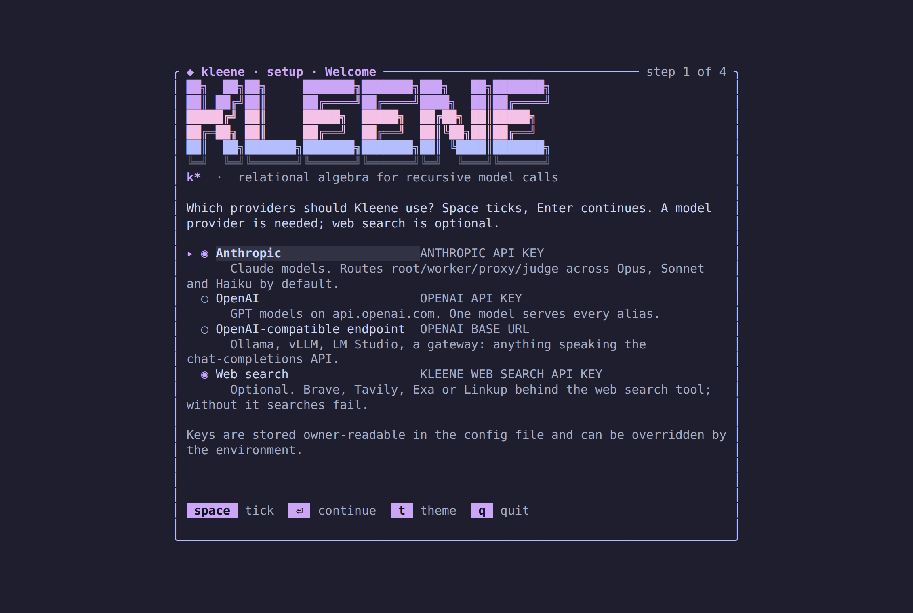
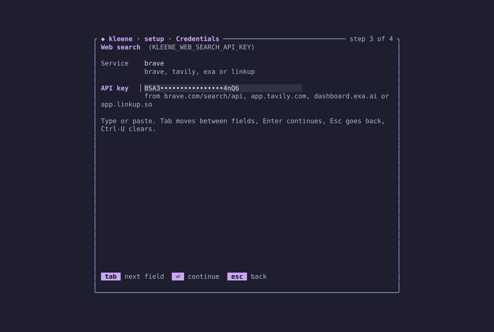
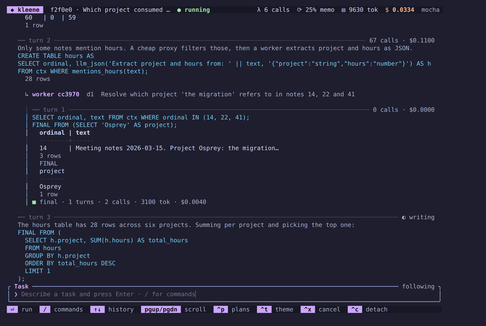
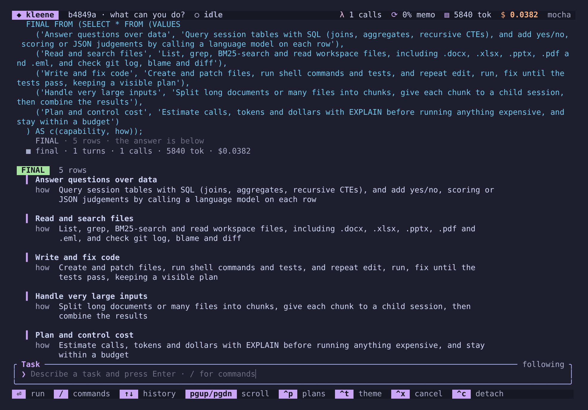
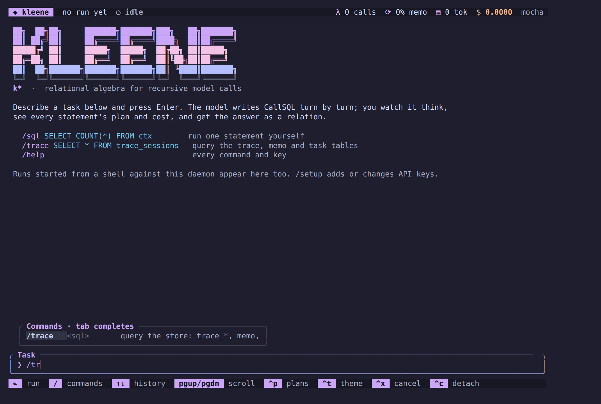

# The `kleene` CLI

Install, point it at a model, and run. Every command below is one binary,
`kleene`; run `kleene --help` or `kleene <command> --help` for the
flags as compiled.

- [Install](#install)
- [Set up a model provider](#configuring-a-model-provider) (`kleene setup`)
- [First run](#first-run)
- [Global flags and files](#global-flags-and-files)
- [Commands](#commands): `run`, `resume`, `repl`, `explain`, `trace`, `tui`,
  `attach`, `daemon`, `learn`, `bench`
- [Working from source](#working-from-source)
- [Troubleshooting](#troubleshooting)

## Install

Prebuilt binaries for macOS (Apple silicon and Intel) and Linux (x86_64 and
aarch64) are attached to every tagged release. Pick one of the three.

### curl

```bash
curl -fsSL https://raw.githubusercontent.com/MarcusElwin/kleene/main/install.sh | sh
```

The script detects your OS and architecture, downloads the latest release
tarball and the release's `SHA256SUMS`, verifies the checksum, and installs to
`~/.local/bin` (or `/usr/local/bin` when run as root). It tells you if the
destination is not on your `PATH`. Environment variables it honours:

| Variable | Effect | Default |
|---|---|---|
| `KLEENE_VERSION` | Install a specific tag, e.g. `v0.1.0` | latest release |
| `KLEENE_INSTALL` | Destination directory | `~/.local/bin` |
| `KLEENE_REPO` | `owner/repo` to fetch from | `MarcusElwin/kleene` |
| `GITHUB_TOKEN` (or `GH_TOKEN`) | Token with read access to the repository; required while it is private, and raises the API rate limit otherwise | unset |

Read it before piping it into a shell if that is your habit:
[`install.sh`](../install.sh) is a hundred lines of POSIX `sh` and needs only
`curl` and `tar`.

**While the repository is private**, the raw URL above returns 404, with or
without a token: `raw.githubusercontent.com` does not serve private files.
Fetch the script through the API's contents endpoint instead, which returns
the file itself with the `vnd.github.raw` accept header. `gh auth token`
prints the token the GitHub CLI holds:

```bash
export GITHUB_TOKEN="$(gh auth token)"
curl -fsSL -H "Authorization: Bearer $GITHUB_TOKEN" -H "Accept: application/vnd.github.raw" \
  "https://api.github.com/repos/MarcusElwin/kleene/contents/install.sh?ref=main" | sh
```

or, letting `gh` handle the authentication:

```bash
export GITHUB_TOKEN="$(gh auth token)"
gh api -H "Accept: application/vnd.github.raw" repos/MarcusElwin/kleene/contents/install.sh | sh
```

The script downloads release assets through the GitHub API with the same
token, which works for private and public repositories alike.

Releases come from the workflow in `.github/workflows/release.yml`: a merge
to `main` that bumps the workspace version (or a pushed `v*` tag) builds the
four targets, attaches the tarballs and `SHA256SUMS`, and prints the values
the Homebrew formula needs.

### Homebrew

```bash
brew tap MarcusElwin/kleene https://github.com/MarcusElwin/kleene
brew trust MarcusElwin/kleene   # Homebrew 7 asks once for third-party taps
brew install kleene
```

Homebrew refuses a formula given by path (`Homebrew requires formulae to be
in a tap`), and `brew install MarcusElwin/kleene/kleene` would look for a
repository named `homebrew-kleene`; so the repository is its own tap. `brew
tap` with the URL clones it and reads [`Formula/kleene.rb`](../Formula/kleene.rb),
whose stable stanzas download the release binaries and verify their SHA-256.
Homebrew 7 refuses formulae from an untrusted third-party tap, so `brew trust`
is needed once per machine (older Homebrew has no such command and no such check).
`brew install --HEAD kleene` clones `main` and builds with cargo instead
(about ten minutes, DuckDB included). After each release the sha256 values
in the formula are updated from the release's `SHA256SUMS`.

### cargo

```bash
cargo install --git https://github.com/MarcusElwin/kleene kleene
```

Needs Rust 1.88 or newer and about ten minutes: DuckDB is compiled from source
on the first build. `rustup` picks the toolchain pinned in
`rust-toolchain.toml` automatically inside a checkout; `cargo install --git`
uses your default toolchain.

While the repository is private, `cargo install --git` over HTTPS fails with
`failed to authenticate when downloading repository`: cargo fetches with its
own git library, which does not consult your credential helper. Any of these
works instead:

```bash
cargo install --path crates/kleene                    # from a checkout you already have
CARGO_NET_GIT_FETCH_WITH_CLI=true \
  cargo install --git https://github.com/MarcusElwin/kleene kleene   # let the git CLI authenticate
cargo install --git ssh://git@github.com/MarcusElwin/kleene kleene   # over SSH
```

### Check

```bash
kleene --version
kleene repl -c "SELECT 1 + 1 AS two"
```

The second line runs the relational core without a model and prints a
one-row table. If it prints `two` and `2`, the engine works.

## Configuring a model provider

Nothing that touches a model runs until one credential is set. Kleene
speaks two wire formats directly, with no SDK and no gateway required.

### `kleene setup`

The guided way. It asks which providers to use (a model provider, and
optionally the service behind the `web_search` tool), takes the keys with the
input masked, and writes them to the config file:

```bash
kleene setup
```



```
╭ ◆ kleene · setup · Welcome ─────────────────────── step 1 of 3 ╮
│ Which providers should Kleene use? Space ticks, Enter continues. │
│                                                                  │
│ ▸ ◉ Anthropic                    ANTHROPIC_API_KEY               │
│       Claude models. Routes root/worker/proxy/judge by default.  │
│   ○ OpenAI                       OPENAI_API_KEY                  │
│   ○ OpenAI-compatible endpoint   OPENAI_BASE_URL                 │
│       Ollama, vLLM, LM Studio, a gateway.                        │
│   ○ Web search                   KLEENE_WEB_SEARCH_API_KEY       │
│       Optional. Brave, Tavily, Exa or Linkup behind web_search.  │
╰──────────────────────────────────────────────────────────────────╯
```

`kleene tui` runs the same wizard on its own the first time it starts
without a configured provider, and `/setup` at the TUI's prompt opens it
again at any time to add or change keys; saving there asks the running
daemon to reload, so the next run uses the new keys without a restart.
Web search is the fourth row of the first step: tick it with space, and
its own page asks for the service and the key.


Non-interactive forms for scripts:

```bash
kleene setup --anthropic-key sk-ant-...
kleene setup --openai-base-url http://localhost:11434/v1 --openai-model llama3
kleene setup --router ~/.config/kleene/router.toml
kleene setup --web-search-provider brave --web-search-key BSA...   # or tavily, exa, linkup
kleene setup --show          # what is configured, keys masked, and from where
```

The file is `config.toml` in `$KLEENE_CONFIG_DIR`, else
`$XDG_CONFIG_HOME/kleene`, else `~/.config/kleene`, written owner-readable
only:

```toml
[anthropic]
api_key = "sk-ant-..."

[openai_compat]
base_url = "http://localhost:11434/v1"
model = "llama3"

[web_search]
provider = "brave"      # or "tavily", "exa", "linkup"
api_key = "BSA..."
```

Environment variables always win over the file, field by field, so a
one-off `ANTHROPIC_API_KEY=... kleene run` keeps working and CI never needs
the file. A daemon that was already running before `kleene setup` keeps its
old keys until it is restarted or a TUI's `/setup` asks it to reload.

### Environment variables

**Anthropic**

```bash
export ANTHROPIC_API_KEY=sk-ant-...
```

`ANTHROPIC_AUTH_TOKEN` is accepted instead of the key, and
`ANTHROPIC_BASE_URL` overrides the endpoint. With only Anthropic configured
the default routing is: `root` on Opus 5.5 at high effort, `worker` and `judge`
on Sonnet 5, `proxy` on Haiku 4.5 at low effort, prompt prefix cached
everywhere, priced from the first-party rate card.

**OpenAI or any OpenAI-compatible endpoint**

```bash
export OPENAI_API_KEY=sk-...
export OPENAI_MODEL=gpt-5.4-mini          # optional; the model every alias resolves to
```

A local server needs only a URL: `OPENAI_BASE_URL=http://localhost:11434/v1`
with no key. With only this configured, every alias resolves to
`OPENAI_MODEL` (default `gpt-5.4-mini`) and nothing is priced, so dollar
budgets and estimates read zero.

**Both, or your own routing**

Write a router file and point at it (`kleene setup --router <path>`, or the
environment):

```bash
export KLEENE_ROUTER_TOML=~/.config/kleene/router.toml
```

```toml
[aliases.root]
candidates = [{ provider = "anthropic", model = "claude-opus-5-5" }]
options = { effort = "high", cache_prefix = true }

[aliases.worker]
candidates = [
  { provider = "anthropic", model = "claude-sonnet-5" },
  { provider = "openai_compat", model = "gpt-5.4-mini" },   # failover
]
options = { effort = "low" }

[aliases.proxy]
candidates = [{ provider = "anthropic", model = "claude-haiku-4-5" }]

[aliases.judge]
candidates = [{ provider = "anthropic", model = "claude-sonnet-5" }]

[pricing."claude-opus-5-5"]
input_per_mtok = 4.0
output_per_mtok = 20.0
cache_read_per_mtok = 0.4
cache_write_per_mtok = 5.0
```

**Web search**

```bash
export KLEENE_WEB_SEARCH_API_KEY=BSA...
export KLEENE_WEB_SEARCH_PROVIDER=brave     # optional; brave (default), tavily, exa or linkup
```

The `web_search(q [, n])` tool calls Brave Search (`api.search.brave.com`),
Tavily (`api.tavily.com`), Exa (`api.exa.ai`, with a short page text as the
snippet) or Linkup (`api.linkup.so`, standard depth) with this key and
returns `rank, title, url, snippet`, ten rows unless `n` says otherwise, at
most twenty. Without a key
every search fails with `no web search backend configured`.

Candidates are tried in order; one whose calls keep failing is skipped until
its circuit breaker cools down. `options` takes `effort`, `cache_prefix`,
`temperature` and provider-specific `extra`. Aliases are what `SET
model.default = 'worker'`, `CREATE FUNCTION … MODEL 'proxy'` and `CREATE
AGENT … MODEL 'worker'` refer to; you can add your own names.

Every model call is memoised in the store by model and prompt fingerprint,
so re-running a task, demo or benchmark against the same database costs
nothing for prompts it has already seen.

## First run

```bash
mkdir demo && cd demo
kleene setup                                # or: export ANTHROPIC_API_KEY=sk-ant-...

# A task over a context file. The model gets ctx(ordinal, text), one row per
# paragraph, and writes CallSQL until FINAL.
kleene run "Which project consumed the most hours in total?" \
  --context /path/to/kleene/demos/oolong/corpus.txt --budget-calls 60

# See what it cost and what it did.
kleene trace "SELECT depth, role, outcome, turns, calls, dollars FROM trace_sessions"
kleene trace "SELECT sql, rows, calls FROM trace_statements ORDER BY started_at"

# Watch the next one live.
kleene tui --run @task.txt --context corpus.txt
```

Everything lands in `.kleene/run.duckdb` in the current directory. Delete
the directory to start clean, or pass `--db` to use another file.

## Global flags and files

| Flag | Meaning | Default |
|---|---|---|
| `--db <path>` | DuckDB file holding session tables, memo, trace and learning state | `.kleene/run.duckdb` |
| `--workspace <dir>` | Root the tools (`files`, `grep`, `read`, `shell`, `write_file`, …) are confined to | current directory |
| `--log <filter>` | Log filter, e.g. `info` or `kleene=debug` | `warn` |

Files under the working directory:

| Path | What |
|---|---|
| `.kleene/run.duckdb` | the store: your tables, `memo`, `trace_*`, `kleene_sessions`, learning and bench tables |
| `.kleene/daemon.sock` | the daemon's Unix socket (`--socket` on `daemon`, `tui`, `attach`) |
| `~/.config/kleene/config.toml` | provider and web search keys written by `kleene setup` or `/setup` (`KLEENE_CONFIG_DIR` moves it) |
| `~/.config/kleene/mcp.json`, `.kleene/mcp.json` | MCP servers, per user and per project (`kleene mcp add`, `/mcp add`); the project file wins on a name clash |
| `~/.config/kleene/skills/<name>/SKILL.md`, `.kleene/skills/<name>/SKILL.md` | skills, per user and per project (also `~/.agents/skills`, `.agents/skills`, `.claude/skills`); a project skill replaces a user or built-in one of the same name |
| `KLEENE.md`, `AGENTS.md` or `CLAUDE.md` | project instructions at the workspace root, the first found, rendered into every session's prompt |

`.kleene/` is git-ignored in this repository; add it to yours.

Task arguments accept either literal text or `@path` to read a file.

## Commands

### `kleene setup`

Configure providers; see [above](#kleene-setup). Interactive in a terminal,
flag-driven otherwise.

| Flag | Meaning |
|---|---|
| `--anthropic-key <key>` | Anthropic API key (an OAuth token works too) |
| `--anthropic-base-url <url>` | Anthropic endpoint override |
| `--openai-key <key>` | OpenAI or compatible API key |
| `--openai-base-url <url>` | OpenAI-compatible endpoint; a local server needs only this |
| `--openai-model <model>` | The model every alias resolves to without a router |
| `--router <path>` | Router TOML with aliases, failover and pricing |
| `--web-search-provider <name>` | Service behind the `web_search` tool: `brave` (default), `tavily`, `exa` or `linkup` |
| `--web-search-key <key>` | API key for the web search service |
| `--show` | Print the effective settings with keys masked and stop |

Flags merge into the existing file; providers not mentioned are kept.

### `kleene`

With no arguments, in a terminal, `kleene` opens the terminal UI: a welcome
block, the prompt focused, slash commands one `/` away. Type a task, press
Enter, and watch the run. This is the same UI as `kleene tui`; see below.
Outside a terminal it prints the wordmark and the version.

### `kleene run <task>`

Run a task to completion: the model writes CallSQL turn by turn until
`FINAL`. The reply streams to the terminal as the model writes it, with the
SQL highlighted and the prose dimmed; a spinner shows while the model thinks
and while its statements run, counting the model calls they make; each
statement's rows print as a table, errors in red with the hint in yellow; and
the final relation prints as a box-drawn table sized to the terminal. When
stderr is not a terminal, colour and spinners switch off and the output is
plain. Child sessions (`rlm`, `spawn`) are summarised one level in, not
streamed.

```
kleene run <task|@file> [--context <file>] [--max-turns 30] [--max-depth 2]
              [--budget-calls N] [--budget-dollars X] [--check <cmd>] [-q|--quiet]
```

| Flag | Meaning |
|---|---|
| `--context <file>` | Loaded as table `ctx(ordinal, text)`, one row per blank-line-separated paragraph |
| `--max-turns` | Turn cap for the root session (default 30); `resume` grants more |
| `--max-depth` | Deepest child session allowed (default 2); `0` disables `rlm` and `spawn` |
| `--budget-calls`, `--budget-dollars` | Budget for the whole run including children; a statement whose estimate exceeds what is left is refused with its plan |
| `--check <cmd>` | A shell command run in the workspace whenever the root session writes `FINAL`; a non-zero exit refuses the `FINAL`, renders the output back and the session continues. Give a code task its test command (`--check 'python3 -m unittest -q'`) and it cannot end red |
| `-q` | Print only the final relation |

The run id is printed with the result and stored in `trace_runs`. The
session's earlier turns are folded into the table `turns(run, n, sql, result)`
once more than sixteen have run (the last eight stay in the prompt in
full), a table named `plan(step, status)` is shown by the UI as the task's
plan, and the skills and MCP tools below are in every session's catalog.
`turns` is kept across runs, and `memory(key, value)` is a plain table the
model can `INSERT INTO` to keep a fact for later runs.

Tasks typed in the TUI belong to a conversation: every run records its task
and its answer in `conversations(conversation, run, n, role, text, ts)`, and
a follow-up run's task message shows the last four messages inline and
points at the table for the rest. `/new` in the TUI starts another
conversation; `kleene run` runs outside any.

### `kleene resume <run-id>`

Continue a root session that stopped at its turn cap or was interrupted.
Transcript, defined functions, agents, settings and spend are restored from
`kleene_sessions`; turn numbering continues.

```
kleene resume <run-id> [--max-turns 30] [-q]
kleene trace "SELECT run, outcome, turns FROM trace_sessions WHERE depth = 0"
```

### `kleene repl`

An interactive CallSQL REPL against the store. Reads statements from stdin,
one per line or terminated by `;`, plans each just before running it, and
prints the rendered rows with a footer of calls, tokens and dollars when a
statement made calls.

```bash
kleene repl                                   # interactive
kleene repl -c "SELECT 1 + 1 AS two"          # one statement
kleene repl < demos/planner/three_way.sql     # a script
```

Everything in [`DIALECT.md`](DIALECT.md) works here: `CREATE FUNCTION … AS
PROMPT`, `CALL shell(...)`, `SET budget.calls = 20`, `EXPLAIN`, `WITH
RECURSIVE`. Tables you create persist in the store, so the next `repl` or
`run` sees them.

### `kleene explain <sql>`

Print the call plan for one statement without executing it: per operator the
estimated rows, calls, tokens and dollars, call kinds, fences, the complexity
fragment, the rules that fired, the join-order plan space and the priced
alternatives. Needs no provider.

```bash
kleene explain "SELECT c FROM candidates WHERE llm_bool('Is ' || c || ' a real place?')"
```

`EXPLAIN ANALYZE <statement>` inside `repl` also runs it and prints actuals.

### `kleene trace <sql>`

Run DuckDB SQL directly over the store: the trace tables, the memo, the
learning and bench tables, and your own session tables.

```bash
kleene trace "SELECT depth, role, outcome, turns, calls, dollars FROM trace_sessions ORDER BY started_at"
kleene trace "SELECT alias, model, memo_hit, cost_usd FROM trace_calls ORDER BY started_at DESC LIMIT 20"
kleene trace "SELECT tool, args, elapsed_ms FROM trace_tool_calls"
kleene trace "SELECT cte, round, delta_rows FROM trace_rounds"
```

Tables: `trace_runs`, `trace_sessions`, `trace_statements`, `trace_calls`,
`trace_tool_calls`, `trace_rounds`, `trace_final`, `memo`,
`kleene_sessions`, plus the learning tables (`tasks`, `attempts`,
`playbook`, `playbook_evals`, `task_ratings`, `solver_ratings`,
`generator_state`, view `trace_tasks`) and the bench tables (`evals`,
`bench_runs`). Your own session tables are here too.

### `kleene tui`

Open the terminal UI over the engine daemon, starting one in the background
if nothing is listening on the socket. The first time, with no provider
configured, it runs the setup wizard before connecting. `kleene` alone does
the same.

```
kleene tui [--run <task|@file>] [--context <file>] [--socket <path>]
```



It is one scrolling stream, in the manner of prime-agent and opencode: a
header with the run, its status and the spend; the stream; a prompt that
always has focus; a footer of keys. A task typed at the prompt starts a run
on the daemon. The run appears in the stream as it happens: each turn under
a rule with its calls and cost, the model's reply streaming in with the SQL
highlighted, every statement's result, child sessions one level in, and the
answer as a FINAL block. Once a turn is done it folds: the first sentence of
the model's prose becomes the turn's headline on its rule, the rest of the
prose is hidden, and a `FINAL` statement shows only its first line, so a
finished run reads as one line of intent, the SQL, the results and the
answer per turn.



The FINAL block is laid out for a person, from the relation itself rather
than the text the model saw, so no cell is cut short. A table of short cells
that fits the width stays a grid. Otherwise each row becomes a card: a
single-column relation is a list (one value alone is plain text), and a wider
one shows its first column as the title when that is short, then one `name
value` line per remaining column with the value word-wrapped under it. The
turn that ran the `FINAL` statement shows one line in its place, with the row
count, so the answer appears once. `Ctrl-P` unfolds every turn: the model's
prose in full, each statement's `EXPLAIN` under it, the whole `FINAL`
statement, and the FINAL table exactly as the model saw it, cells cut at 60
characters. Runs started against the same daemon from another client (`kleene tui
--run`, `kleene attach --run`) appear in the same stream; `kleene run` is
in-process and does not go through the daemon.



Slash commands, with completion (type `/`, `Tab` completes, `↑`/`↓` pick):

| Command | Does |
|---|---|
| `/help` | the commands and keys |
| `/sql <statement>` | run one CallSQL statement in an interactive session; the result prints inline |
| `/trace <sql>` | query the store (`trace_*`, `memo`, `tasks`, `evals`, your tables) as a table |
| `/board` | the continual loop's task board |
| `/runs` | live runs on this daemon |
| `/follow <run>` | show a run by the tail of its id; new runs are followed on their own |
| `/cancel` | cancel the run being followed |
| `/plans` | show or hide `EXPLAIN` plans under statements |
| `/theme [flavour]` | next Catppuccin flavour, or `mocha`, `macchiato`, `frappé`, `latte` |
| `/setup` | the setup wizard over the stream: add or change model provider and web search keys; saving reloads the daemon |
| `/mcp` | the configured MCP servers with their state and tools |
| `/mcp add <name> <command> [args...]` | add a server to the user's `mcp.json` and reload; `/mcp remove <name>` drops it |
| `/skills [name]` | the loaded skills with their source and description, or one skill in full |
| `/clear` | clear the stream |
| `/quit` | detach; the daemon and its runs keep going |

A session that keeps a `plan` table shows it under its latest turn, one
line per step with `✓` done, `◐` doing and `○` todo.

Keys:

| Key | Action |
|---|---|
| `Enter` | run the task, or the command |
| `Tab` | complete the command |
| `↑` / `↓` | walk the input history, or move in the command popup |
| `PgUp` / `PgDn`, `Home` / `End` | scroll the stream; `End` follows the newest output again |
| `Ctrl-P` | show or hide plans |
| `Ctrl-T` | next Catppuccin flavour; `KLEENE_THEME=latte` picks the starting one |
| `Ctrl-X` | cancel the run being followed |
| `Ctrl-U` | clear the input |
| `Esc` | clear the input and close the command popup |
| `Ctrl-L` | clear the stream |
| `Ctrl-C` | detach; the daemon and its runs keep going |

### `kleene attach`

Headless twin of `tui`: attaches to the daemon and prints every server
message as a JSON line. With `--run`, starts that task on connect and exits
when it finishes, so it can drive scripts and evaluations.

```bash
kleene attach --run "Sum 1..4" | jq -c 'select(.msg == "run_finished")'
```

### `kleene daemon`

Run the engine in the foreground on a Unix socket (`--socket`, default
`.kleene/daemon.sock`). Clients speak newline-delimited JSON: `Subscribe`
with a cursor for replay, `StartRun`, `Submit` (REPL statements in a
client-owned session), `Query` (SQL over the store), `Cancel`, `CancelRun`,
`ListRuns`, `ListMcp`, `ListSkills`, `Reload` (re-read the keys, `mcp.json`
and the skills; `/setup` and `/mcp add` send it after saving), `Detach`.
Two clients see the same event stream; a client that
reconnects resumes from its last cursor. See
[`ARCHITECTURE.md`](ARCHITECTURE.md#processes).

### `kleene mcp`

Model Context Protocol servers. `kleene mcp` (or `kleene mcp list`)
connects every configured server and prints its state, its tools' catalog
names and its command line. `kleene mcp add <name> <command> [args...]
[--env KEY=VALUE] [--project]` writes the server to the user's `mcp.json`
(the project's `.kleene/mcp.json` with `--project`); `kleene mcp remove
<name> [--project]` drops it. A server's tools join every session's catalog
as `<name>_<tool>`: read-only ones (`readOnlyHint`) are table functions
used in `FROM`, the rest run as `CALL`. The format of `mcp.json` is the one
every MCP client reads:

```json
{ "mcpServers": { "fs": { "command": "npx", "args": ["-y", "@modelcontextprotocol/server-filesystem", "."] } } }
```

A server that fails to start is reported and contributes no tools; nothing
else changes. Only stdio servers are supported.

### `kleene skills`

`kleene skills` lists every skill a session in this workspace can read:
the six built into the binary (`code-task`, `create-skill`,
`run-benchmark`, `add-mcp-server`, `plan-queries`, `long-context`), the
user's and the project's. `kleene skills <name>` prints one in full. A
skill is a directory with a `SKILL.md` (frontmatter `name` and
`description`, then Markdown); the prompt carries only the names and
descriptions, and the model reads a body with `SELECT text FROM
skill('name')`. The `create-skill` skill explains how to write one.

### `kleene learn`

The continual loop: generated and user tasks with code oracles, ratings, a
curriculum, and a playbook of winning SQL adopted only after a replay eval.
State lives in the store, so every command resumes where the last stopped.

| Command | What it does |
|---|---|
| `learn run [--tasks 10] [--budget-dollars X] [--minutes M] [--generators a,b] [--queue 3] [--replay 3]` | Run unattended until a limit: keep `--queue` pending tasks per generator, pick the task nearest even odds, attempt it, judge, update ratings and dials, gate playbook candidates over `--replay` recent tasks (`0` adopts outright) |
| `learn add <task|@file> [--kind user] [--context <file>] [--expect "a\|b;c\|d"] [--check '<shell>']` | Add a task. `--expect` gives exact rows; `--check` runs a shell oracle with the answer rows as JSON on stdin (exit 0 = pass); neither means it waits for human review |
| `learn generate <generator> [--count 3]` | Generate tasks at the generator's current dial: `sat3`, `graph`, `puzzle`, `corpus`, `repo`, `statements`, `contracts` |
| `learn propose <topic>` | Ask the model for a task, rubric and reference; a separate `judge` call grades attempts |
| `learn step [<task-id>]` | Attempt one task now, by id or the curriculum's pick |
| `learn board` | Counts per generator and status, and each dial |
| `learn report` | Solve rate, calls and depth by generator and difficulty (`trace_tasks`) |
| `learn playbook` | The version ledger with eval notes and wins/tries |
| `learn revert <version> [--function]` | Withdraw a playbook version, or with `--function` a learned function version (the previous version of that name is adopted again) |
| `learn functions` | The learned function ledger: every version, whether it is adopted, and the replay note |
| `learn add-function '<CREATE FUNCTION ...>'` | Put a prompt-defined function in the ledger as the adopted baseline of its name; solved runs seed the ledger with the functions they defined |
| `learn refine <name> [--kind k]` | Ask the model for a better prompt from the adopted definition and recent failed attempts, then replay `--replay` tasks with and without it; adopted only when it solves at least as many at no more cost. Every session defines the adopted versions before its first turn |

```bash
kleene learn run --tasks 50 --budget-dollars 5 --generators puzzle,corpus,graph   # overnight
kleene learn report                                                                 # the morning query
```

### `kleene bench`

Benchmarks over task packs (`tasks/<pack>/pack.json`) in one of three modes,
every task in a fresh workspace, every result a row in `evals`. What the
modes, oracles, report columns and plots measure is in
[`docs/BENCHMARKS.md`](BENCHMARKS.md).

| Command | What it does |
|---|---|
| `bench run <pack-dir> [--mode learning\|frozen\|plain] [--limit N] [--sample N --seed S] [--outputs <dir>] [--record <dir>] [--replay <dir>] [--resume <run-id>]` | Run a pack. `learning` shows and adopts the playbook; `frozen` is the control; `plain` is a tool-calling agent on the same provider, tools and budget. `--sample` runs a seeded sample of N tasks in pack order; `--outputs` exports every task's `output/` in the layout Harvey LAB's evaluator reads and prints the `run_eval` commands; `--record` saves every model reply as fixtures; `--replay` serves them offline. A task that ends without a token spent (no credit, a bad key) stops the run with the reason in `bench_runs.note`; `--resume` continues that run at the first task without a row |
| `bench build <out-dir> --from <generator> [--count 20] [--dial 0.5] [--seed 1] [--lazy]` | Freeze generator output into a pack; same seeds, same tasks. `--lazy` stores generator references and regenerates on load. Generators: `sat3`, `graph`, `puzzle`, `corpus`, `repo`, `statements`, `contracts`, `logbook`, `memo` |
| `bench terminal <out-dir>` | Write the built-in Terminal-Bench-style pack |
| `bench import-lab <checkout>/tasks <out-dir> [--sample N --seed S]` | Import a Harvey LAB checkout (or one practice area under it) into a pack with the shipped rubrics; `--sample` imports a seeded sample and copies only its documents |
| `bench import-oolong <out-dir> [--dataset trec_coarse] [--context-len 131072] [--limit 50] [--offset 0] [--split validation\|test] [--from-json <file>]` | Import OOLONG-synth questions from Hugging Face into a pack with the `oolong` oracle; the defaults are the RLM paper's trec_coarse 128k split |
| `bench import-redlining <out-dir> [--dataset 1k\|10k\|<repo>] [--split test\|train] [--limit 100] [--offset 0] [--from-json <file>]` | Import UmaiTech's contract redlining examples (synthetic redlines over CUAD, CC BY 4.0) from Hugging Face into a pack with the `redline` oracle; the default is the 1k set's held-out test split |
| `bench report` | Accuracy, calls and dollars per pack and mode |
| `bench curve <run-id> [--window 5]` | The learning curve of one run as a sparkline and rolling mean |
| `bench csv` | Every eval row as CSV on stdout |
| `bench plot <out-dir>` | The write-up's plots as SVG files: `learning_curve`, `cost_parity`, `calls_vs_difficulty`, `estimate_accuracy` (the planner's estimated calls against actuals, from `trace_statements`) and `plan_space` (join orders against relations joined) |
| `bench results <evals.csv>... [--out plots/results] [--readme README.md] [--plot <pack>]...` | Results from several models side by side: reads `bench csv` files (every row names its model), writes `results.md` (one row per pack, mode and model with pass rate, $/task, calls, tokens and seconds as columns; a model not run on a pack and mode keeps a blank row) and one pass-rate-against-cost Pareto SVG per pack; `--plot` limits which packs' plots the Markdown shows (default all); `--readme` replaces the block between `<!-- bench-results:begin -->` and `<!-- bench-results:end -->` in that document |

```bash
kleene bench import-oolong tasks/oolong-trec && kleene bench run tasks/oolong-trec --mode frozen
kleene bench import-redlining tasks/redlining-1k && kleene bench run tasks/redlining-1k --mode plain
kleene bench run tasks/oolong-like --mode frozen --record fixtures/oolong
kleene bench run tasks/oolong-like --mode learning --replay fixtures/oolong
kleene bench run tasks/terminal --mode plain
kleene bench report && kleene bench csv > evals.csv
kleene bench results plots/evals.csv plots/haiku-2026-10-01/evals.csv \
  plots/haiku-2026-10-06/evals.csv plots/luna-2026-10-05/evals.csv \
  plots/opus-2026-10-06/evals.csv --readme README.md \
  --plot coding --plot memo-rubric --plot logbook-hard
```

Shipped packs are described in [`tasks/README.md`](../tasks/README.md).

## Working from source

```bash
git clone https://github.com/MarcusElwin/kleene && cd kleene
cargo build --release                       # first build compiles DuckDB: ~10 min, ~4 GB
./target/release/kleene --help
cargo run -- repl -c "SELECT 42 AS answer"   # debug build, same engine
```

The checks CI runs, in the shape that reuses the DuckDB build:

```bash
cargo fmt --all -- --check
cargo clippy --workspace --all-targets --all-features -- -D warnings
cargo test --workspace --all-features
RUSTDOCFLAGS="-D warnings" cargo doc --workspace --no-deps
```

`CLAUDE.md` explains why the flags are shaped that way and how to keep
`target/` from filling the disk. Releases are built by the workflow in
`ci/release.yml` on `v*` tags (four targets, tarballs with SHA-256 files,
formula values printed in the job log).

## Troubleshooting

**`no model provider configured`** — run `kleene setup`, or set
`ANTHROPIC_API_KEY`, `ANTHROPIC_AUTH_TOKEN`, `OPENAI_API_KEY` or
`OPENAI_BASE_URL`. `repl`, `explain` and `trace` work without one as long as
the statement makes no calls. `kleene setup --show` says what is configured
and whether it came from the file or the environment.

**Estimates and dollars are all zero** — the model is not in the pricing
table. Only the Anthropic defaults come priced; add a `[pricing."model"]`
section to your router TOML.

**A statement is refused with its plan** — the estimate exceeded the
remaining call or dollar budget. Raise `--budget-*`, or narrow the query;
`EXPLAIN` shows where the calls go.

**The TUI shows nothing** — a stale socket from a killed daemon. Remove
`.kleene/daemon.sock` or pass a fresh `--socket`.

**A `ctx` table already exists** — an older run left one in this database.
Current versions replace it per run; on an old file, `kleene trace "DROP
TABLE ctx"`.

**Building takes forever or fills the disk** — that is DuckDB compiling from
source, once per build profile. Keep `target/` between runs, and see
`CLAUDE.md` before deleting anything under it.
